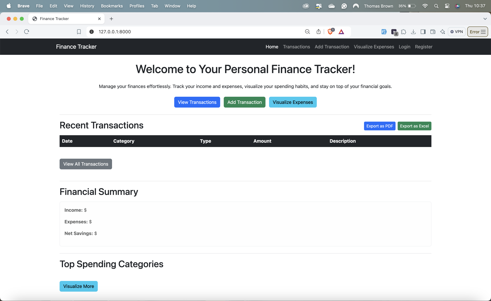
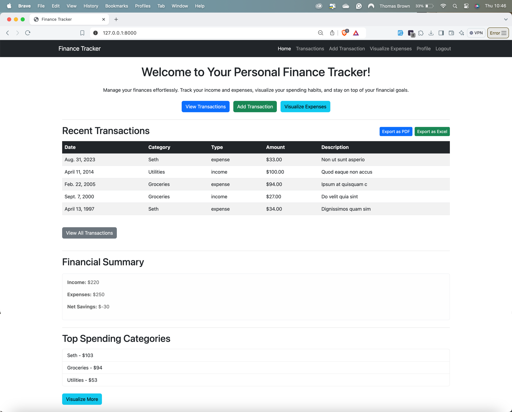
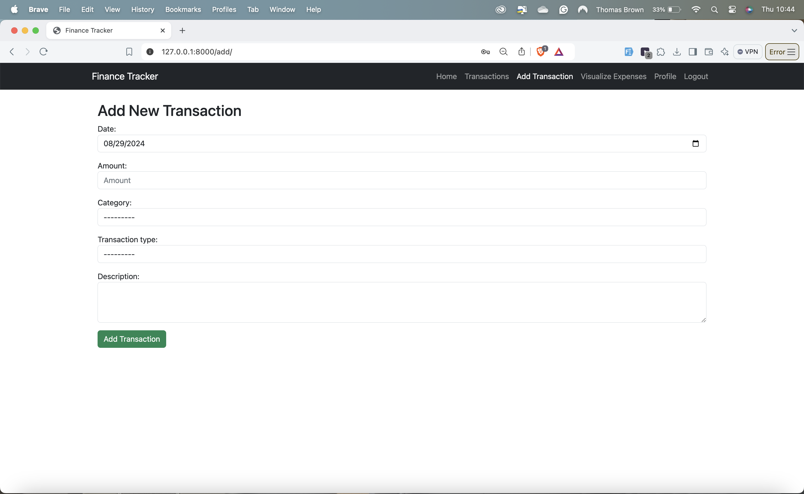
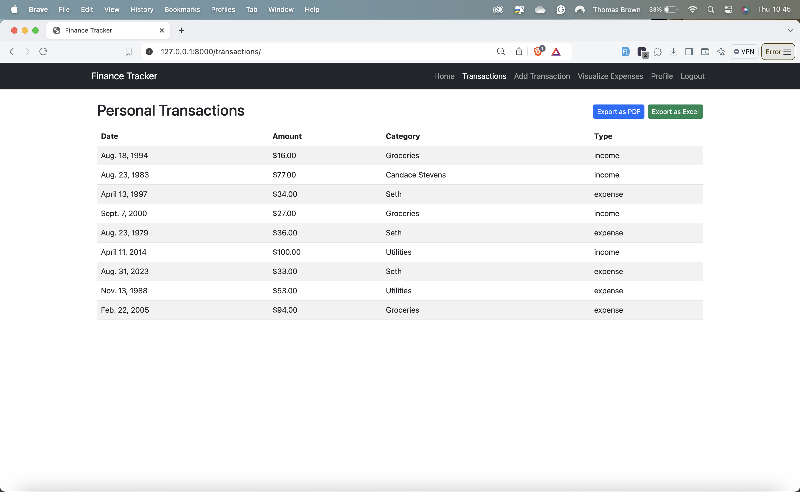

# Finance Tracker


## Overview

**Finance Tracker** is a Django-based web application designed to help users manage their finances by tracking income, expenses, and visualizing financial data. Users can add transactions, categorize them, and generate reports in PDF or Excel format. The application is responsive, secure, and user-friendly.

## Features

- **User Registration & Authentication**: Secure user registration and login functionality.
- **Add Transactions**: Easily add income or expense transactions.
- **Category Management**: Categorize transactions for better financial organization.
- **Transaction Visualization**: Visualize expenses by category using bar charts.
- **Export Reports**: Export transaction reports as PDF or Excel files.
- **Responsive Design**: Works seamlessly on both desktop and mobile devices.

## Tech Stack

- **Backend**: Django, Python 3.12
- **Frontend**: HTML5, CSS3, Bootstrap 5.2.3
- **Database**: SQLite (default, can be replaced with PostgreSQL or MySQL)
- **Reports**: ReportLab for PDF generation, OpenPyXL for Excel file creation

## Installation

1. **Clone the repository**:
    ```bash
    git clone https://github.com/TBJr/finance_tracker.git
    cd finance_tracker
    ```

2. **Create a virtual environment**:
    ```bash
    python3 -m venv .venv
    source .venv/bin/activate
    ```

3. **Install dependencies**:
    ```bash
    pip install -r requirements.txt
    ```

4. **Apply migrations**:
    ```bash
    python manage.py makemigrations
    python manage.py migrate
    ```

5. **Create a superuser**:
    ```bash
    python manage.py createsuperuser
    ```

6. **Run the development server**:
    ```bash
    python manage.py runserver
    ```

7. **Access the application**:
    - Open your browser and go to `http://127.0.0.1:8000/`

## Usage

- **Register and Login**: Users need to register and log in to access the application features.
- **Add Categories**: Go to the admin panel to add new categories or use the default ones.
- **Add Transactions**: Use the "Add Transaction" form to record income or expenses.
- **View Transactions**: View your transaction history and filter by date or category.
- **Visualize Data**: Visualize your expenses by category using the "Visualize Expenses" option.
- **Export Reports**: Export your transaction history as PDF or Excel for offline use.

## Screenshots






## Contributing

Contributions are welcome! Please fork the repository and submit a pull request.

## License

This project is licensed under the MIT License. See the [LICENSE](LICENSE) file for details.

## Contact

For any inquiries or issues, please contact [Thomas](mailto:info@evolvtech-gambia.com).

